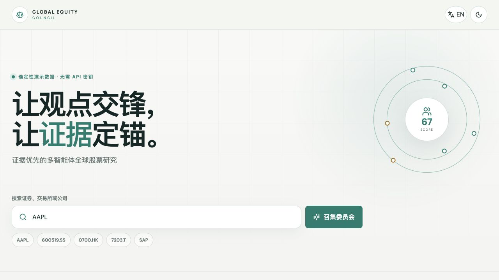
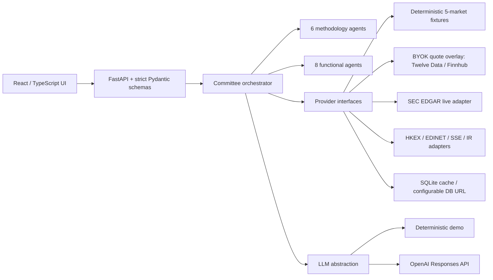
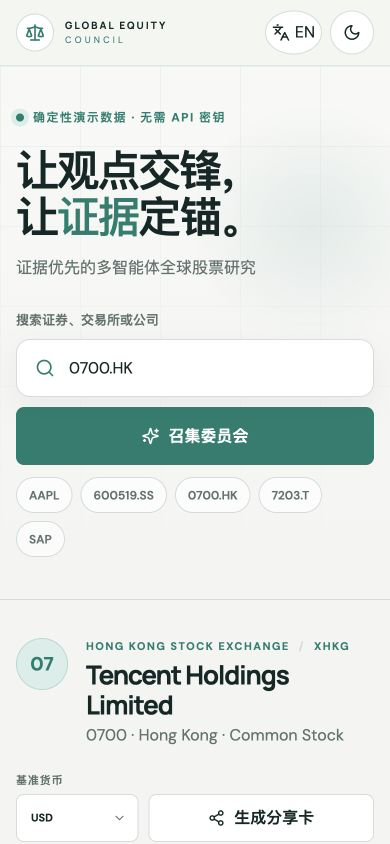

# Global Equity Council

An open-source, evidence-first global equity research application. Enter a
security, select the exact listing, and a committee of methodology-driven agents
verifies data, frames valuation scenarios, debates the bear case, and publishes
a transparent research memo.

> Research and education only. Not investment advice. The inspired-by agents do
> not represent or imply endorsement by any investor or organization.



## What it does

- Searches by ticker, provider symbol, exchange, MIC, or company name.
- Resolves securities with `MIC:symbol`; the same ticker on two exchanges opens
  a listing chooser.
- Runs six investor-methodology agents and eight functional agents with strict
  Pydantic output schemas.
- Separates facts, inferences, and opinions; every critical datum keeps source,
  publication/retrieval time, currency, data mode, confidence, and provenance.
- Produces bear/base/bull valuation ranges, explicit assumptions, dated FX
  conversion, sensitivity, catalysts, risks, invalidation conditions, votes,
  consensus, and major disagreements.
- Works in Chinese and English, light and dark themes, desktop and mobile.
- Exports a source-aware SVG share card with exchange, analysis date, data mode,
  and disclaimer.
- Runs without credentials using deterministic fixtures; OpenAI is an opt-in
  provider.

## Market coverage

| Region | Verified fixture | Identity | Trading / reporting | Accounting | Primary source direction |
| --- | --- | --- | --- | --- | --- |
| United States | AAPL | `XNAS:AAPL` | USD / USD | US GAAP, Sep FY | SEC EDGAR |
| Mainland China | 600519.SS | `XSHG:600519` | CNY / CNY | CAS, Dec FY | SSE filing |
| Hong Kong | 0700.HK | `XHKG:0700` | HKD / CNY | IFRS, Dec FY | Tencent IR / HKEX |
| Japan | 7203.T | `XTKS:7203` | JPY / JPY | IFRS, Mar FY | Toyota IR / SEC 20-F |
| Europe | SAP.DE | `XETR:SAP` | EUR / EUR | IFRS, Dec FY | SAP IR / Deutsche Börse |

`SAP` intentionally also maps to `XNYS:SAP` (ADR) to verify ambiguity and
primary-listing behavior. Architecture can add markets without changing
committee business logic.

## Run from zero

Prerequisites: Node.js 20+ and Python 3.11+.

```bash
git clone <repository-url>
cd global-equity-council
npm run install:all
npm run dev
```

Open <http://localhost:5173>. This one command starts the API on port 8000 and
the web app on port 5173. No API key is required.

Or use the single production container:

```bash
docker compose up --build
```

Open <http://localhost:8080>. The container serves the production frontend and
API from one origin and persists SQLite under a named volume.

## Configuration

Copy `.env.example` to `.env`. Defaults are safe for local fixture mode.

| Variable | Default | Purpose |
| --- | --- | --- |
| `LLM_PROVIDER` | `demo` | `demo` or `openai` |
| `OPENAI_API_KEY` | empty | Required only for `LLM_PROVIDER=openai` |
| `OPENAI_MODEL` | `gpt-4.1-mini` | OpenAI Responses API model |
| `DATA_PROVIDER` | `fixture` | `fixture`, `twelvedata`, or `finnhub` quote mode |
| `MARKET_DATA_API_KEY` | empty | Optional BYOK quote key used by Twelve Data or Finnhub |
| `TWELVEDATA_API_KEY` | empty | Optional provider-specific Twelve Data key |
| `FINNHUB_API_KEY` | empty | Optional provider-specific Finnhub key |
| `MARKET_DATA_CACHE_TTL_SECONDS` | `900` | Live quote cache TTL to reduce API usage and rate limits |
| `DATABASE_URL` | SQLite | Provider cache; accepts SQLite or PostgreSQL URLs |
| `SEC_USER_AGENT` | project contact | Required identification for SEC live requests |
| `CORS_ORIGINS` | local origins | Comma-separated browser origins |
| `VITE_API_BASE` | `/api` | Browser API path |
| `FRONTEND_DIST` | `/app/frontend-dist` | Built web assets served by the API container |

The committee calls the selected provider for its chair synthesis.
`OpenAIProvider` uses the Responses API only when explicitly selected and a key
is present. The deterministic provider is the default and emits stable output
for tests. Credentials are never stored in source.

### BYOK live quote mode

Open-source deployments should use Bring Your Own Key (BYOK). Copy
`.env.example` to `.env`, then set either Twelve Data or Finnhub:

```bash
DATA_PROVIDER=twelvedata
TWELVEDATA_API_KEY=your_key_here
```

or:

```bash
DATA_PROVIDER=finnhub
FINNHUB_API_KEY=your_key_here
```

The key is read only by the FastAPI backend. Do not put market-data keys in
frontend code or `VITE_*` variables; those are visible in the browser bundle.
When a live provider succeeds, the `market_price.provenance.data_mode` becomes
`live`. Repeated requests within the TTL return `cached`. If the key is missing,
unsupported, rate-limited, or the provider fails, the API falls back to the
fixture snapshot and labels it as `fixture`.

## Architecture



Provider contracts cover asset search, market data, financial statements,
regulatory filings, corporate actions, news, macro data, and FX. The SEC adapter
implements public submissions retrieval with identification, timeout,
exponential retry, cache, and rate limiting. Other MVP jurisdictions use
normalized primary-source fixtures and retain replacement interfaces.

## Data semantics and limitations

- A fixture is a dated research snapshot, not a current quote. It is visibly
  labeled `fixture` throughout the API, report, and share card.
- BYOK quote providers update only the market-price point. Fundamentals still
  come from sourced filings/fixtures unless a separate fundamentals adapter is
  added.
- Dated ECB-normalized FX rates are for repeatable cross-currency tests, not
  execution.
- GAAP, IFRS, and CAS remain visible. Fiscal year-end and units are never
  silently flattened.
- ADRs and primary listings are distinct assets with different MICs, trading
  currencies, and `primary_listing` flags.
- The valuation engine is a scenario framework. It exposes assumptions and
  ranges; it does not present LLM guesses as precise intrinsic value.
- Free public sources do not guarantee real-time coverage for every exchange.
  Unsupported assets return a clear error instead of fabricated data.
- PostgreSQL uses the same cache contract via psycopg and creates its small
  provider-cache table on first use; SQLite remains the zero-setup default.

## Quality and tests

```bash
npm run format:check       # Prettier + Ruff
npm run lint               # ESLint + Ruff
npm run typecheck          # TypeScript + strict mypy
npm test                   # API/unit/contract/schema/determinism + UI unit
npm run build              # production frontend
npm run check:secrets      # common credential signatures
npm run check              # all non-browser gates above

npm --prefix frontend exec playwright install chromium
npm run test:e2e           # desktop + mobile browser flows
```

CI repeats the quality gate, Playwright tests, and container build. Browser
coverage includes all five markets, ambiguous `SAP`, provenance, modes,
currency/timezone, bilingual UI, theme, share card, and mobile overflow.
Detailed evidence is recorded in [docs/ACCEPTANCE.md](docs/ACCEPTANCE.md).

## Screenshots

| Desktop | Mobile |
| --- | --- |
|  |  |

Additional validation captures live in [`docs/screenshots`](docs/screenshots).

## API

Interactive OpenAPI documentation is at <http://localhost:8000/api/docs>.

- `GET /api/health`
- `GET /api/assets/search?q=SAP`
- `GET /api/assets/{mic}/{symbol}`
- `POST /api/analysis`

Example:

```bash
curl -s http://localhost:8000/api/analysis \
  -H 'Content-Type: application/json' \
  -d '{"asset_id":"XHKG:0700","base_currency":"USD","locale":"en-US"}'
```

## Project documents

- [Decisions](DECISIONS.md)
- [Acceptance evidence](docs/ACCEPTANCE.md)
- [Contributing](CONTRIBUTING.md)
- [Security](SECURITY.md)
- [Roadmap](ROADMAP.md)
- [Notices](NOTICE.md)
- [Apache-2.0 license](LICENSE)

## License

Apache-2.0. See [LICENSE](LICENSE). Public-source citations and company names do
not transfer market-data or trademark rights.
